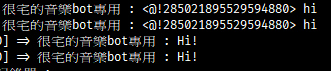

# Discord-Record-Bot
**This is an unfinished bot**  
Mixer by [Licson](https://github.com/licson0729)  
Record discord voice channel and upload files(.mp3) to telegram

## How to use
```
1. npm install 
2. Edit config.json.example and rename it config.json
3. npm run start
```

## Problem
~~1. There may be a memory leak. (Observing)~~  
~~2. There may be noise in the recording file.~~  
~~3. `Error: 4006: Session is no longer valid.` When automatically reconnecting to the voice channel, the bot may be repeatedly activated.  
~~
